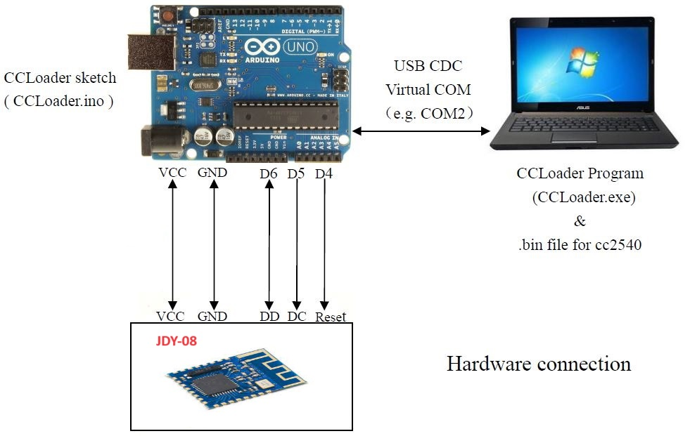

CCLoader
========

Burn CC254x firmware using an Arduino board.

1. Load the CCLoader Arduino sketch to the UNO board.
2. Wire the pins:
  
3. Use CCLoader.exe to load the Demo.bin to the UNO board and the board will burn the firmware to the BLE Mini.
